<div align="center">
  <p>
    <strong>💼 Job Board</strong>
  </p>

  <h1>Job Board with Company & User Dashboard</h1>

  <p><em>A full-stack job board with role-based dashboards for candidates, companies, and admins — advanced job search, a multi-state application workflow, Cloudinary file uploads, in-app & email notifications, and a security-hardened REST API.</em></p>

  <p>
    
    
    
    
    
    
    
    
    
  </p>

  <p>
    <a href="https://job-board-with-company-user-dashboard.netlify.app/">Live Demo</a> •
    <a href="#features">Features</a> •
    <a href="#installation">Quick Start</a> •
    <a href="#api-endpoints">API Docs</a> •
    <a href="#screenshots">Screenshots</a>
  </p>
</div>

---

## Features

- **Role-Based Dashboards** — Separate, tailored experiences for candidates, companies, and administrators with dedicated sidebar navigation and route guards
- **Advanced Job Search** — Multi-dimension filtering (keyword, location, type, experience, education, salary range, skills, industry, sort order) with URL-synced, shareable links
- **Multi-State Application Workflow** — Full hiring pipeline (pending → reviewed → shortlisted → interviewed → offered → hired, plus rejected/withdrawn) with a status-history timeline
- **JWT Authentication** — Access + refresh token rotation, account lockout after failed attempts, token versioning, and auto-refresh on the client
- **Password Reset** — Self-service forgot/reset password flow with hashed, time-limited tokens delivered via email
- **File Uploads via Cloudinary** — CV upload (PDF) with magic-byte validation, image uploads with EXIF stripping, and signed download URLs
- **In-App & Email Notifications** — Real-time notification polling plus transactional emails (Nodemailer) governed by per-user preferences
- **Company Hiring Analytics** — Hiring funnel, application trends, conversion rates, and dashboard statistics
- **Profile Completion Tracker** — Percentage-based progress indicator with a missing-field checklist for candidates
- **Dark Mode** — System / light / dark theme modes with persistent preference via localStorage
- **Responsive Design** — Mobile-first layouts, card-based tables, and skeleton loading states
- **Swagger API Documentation** — Interactive OpenAPI 3.0 spec served at `/api-docs`
- **Security Hardened** — Helmet CSP, 8 specialized rate limiters, refresh-token rotation, password history, NoSQL injection prevention, and audit logging

---

## Live Demo

[🚀 View Live Demo](https://job-board-with-company-user-dashboard.netlify.app/)

### Test Accounts

| Role      | Email                   | Password   |
| --------- | ----------------------- | ---------- |
| Admin     | `admin@jobboard.com`    | `Admin123!` |
| Company   | `technova@jobboard.com` | `Demo123!`  |
| Candidate | `ayse@jobboard.com`     | `Demo123!`  |

> Run `npm run seed` in the `server/` directory to populate the database with the full demo dataset.

---

## Screenshots

All screenshots are captured from the [live deployment](https://job-board-with-company-user-dashboard.netlify.app/) running against the seeded demo dataset.

<table>
  <tr>
    <td align="center" width="33%">
      <a href="./assets/screenshots/home.png">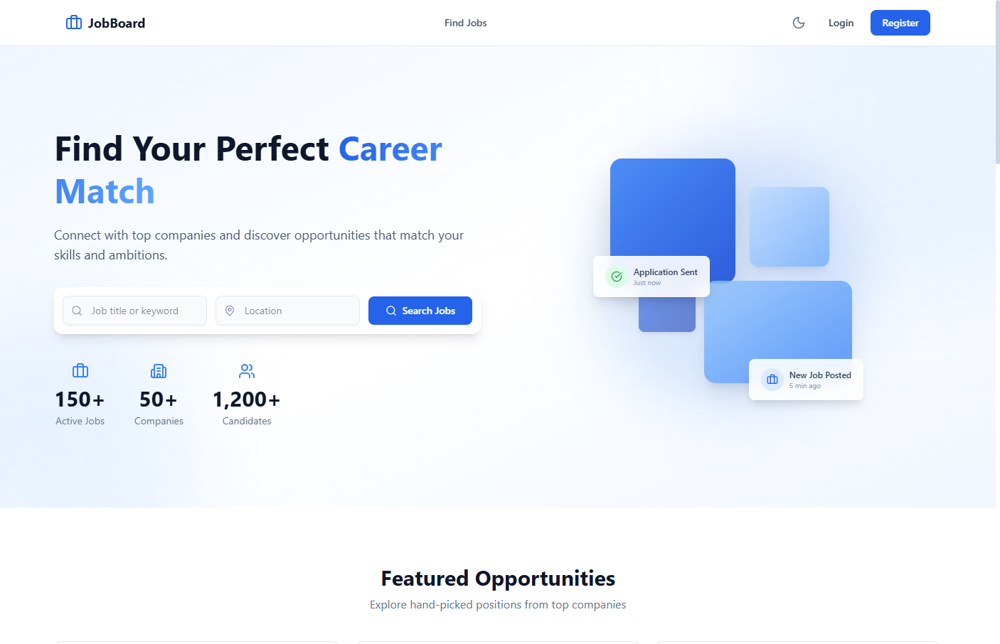</a>
      <sub><b>Home</b><br/>Hero, search & featured jobs</sub>
    </td>
    <td align="center" width="33%">
      <a href="./assets/screenshots/job-list.png">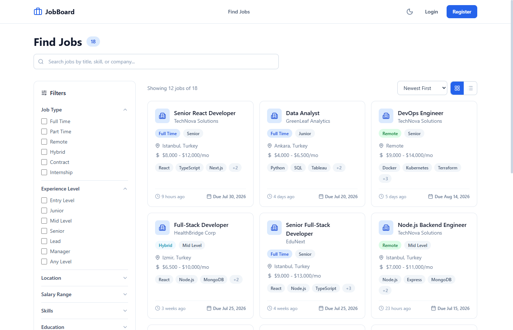</a>
      <sub><b>Job list</b><br/>Multi-dimension filtered search</sub>
    </td>
    <td align="center" width="33%">
      <a href="./assets/screenshots/job-detail.png">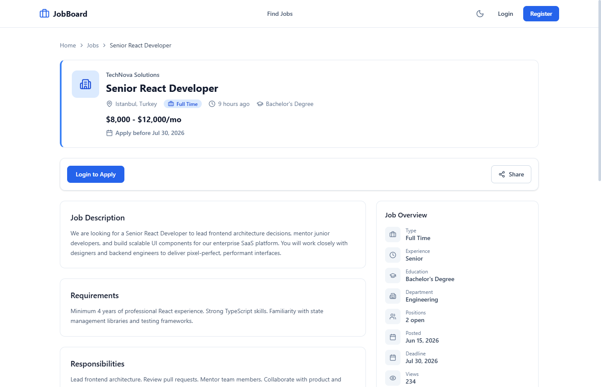</a>
      <sub><b>Job detail</b><br/>Full posting & apply CTA</sub>
    </td>
  </tr>
  <tr>
    <td align="center" width="33%">
      <a href="./assets/screenshots/apply-modal.png">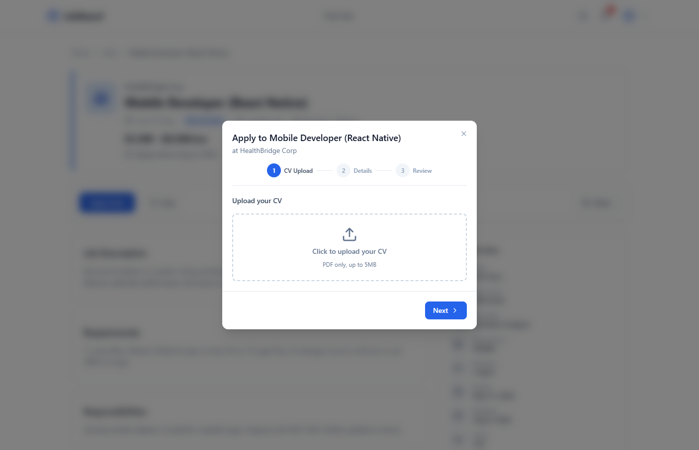</a>
      <sub><b>Apply modal</b><br/>CV upload & cover letter</sub>
    </td>
    <td align="center" width="33%">
      <a href="./assets/screenshots/candidate-dashboard.png">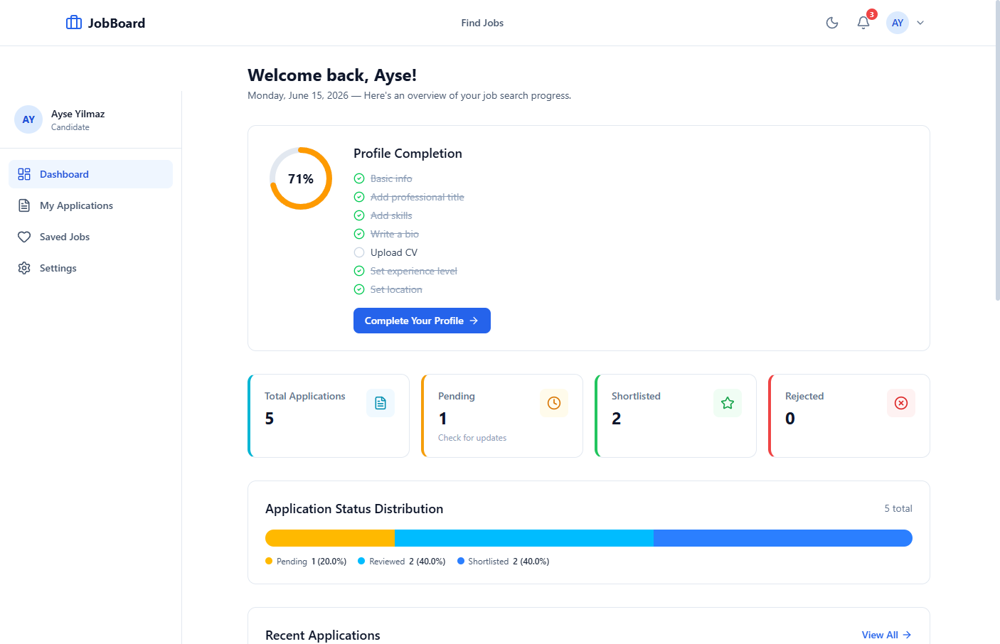</a>
      <sub><b>Candidate dashboard</b><br/>Applications & saved jobs</sub>
    </td>
    <td align="center" width="33%">
      <a href="./assets/screenshots/company-dashboard.png">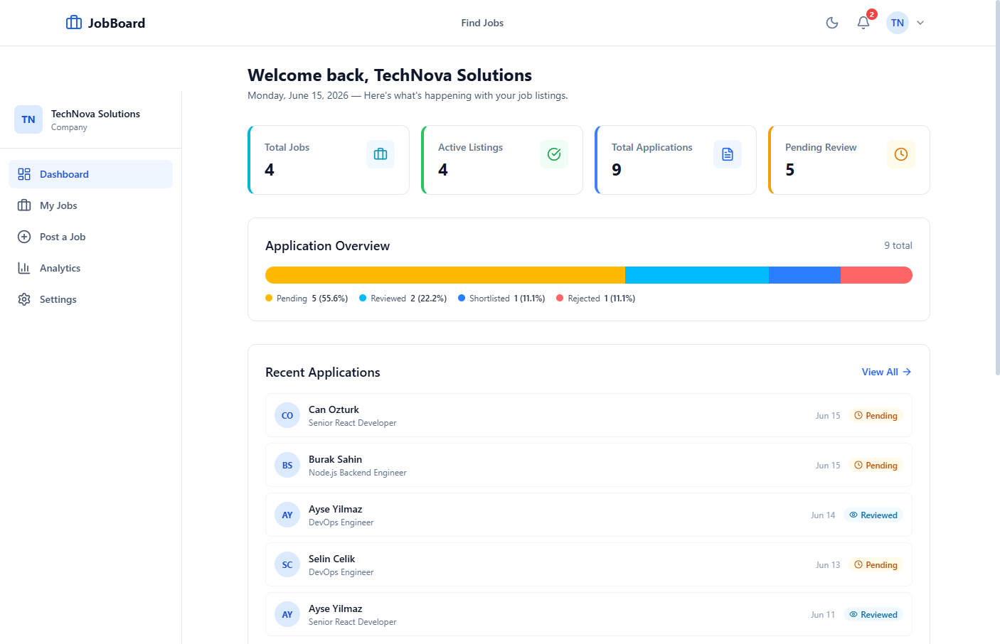</a>
      <sub><b>Company dashboard</b><br/>Jobs, stats & recent activity</sub>
    </td>
  </tr>
  <tr>
    <td align="center" width="33%">
      <a href="./assets/screenshots/company-applications.png">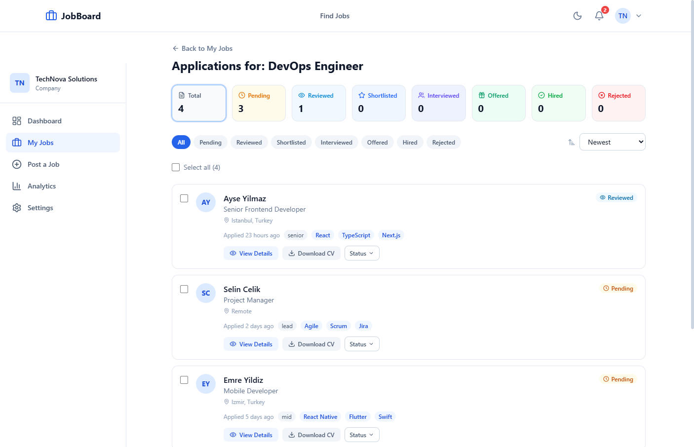</a>
      <sub><b>Applications</b><br/>Status workflow & bulk actions</sub>
    </td>
    <td align="center" width="33%">
      <a href="./assets/screenshots/company-analytics.png">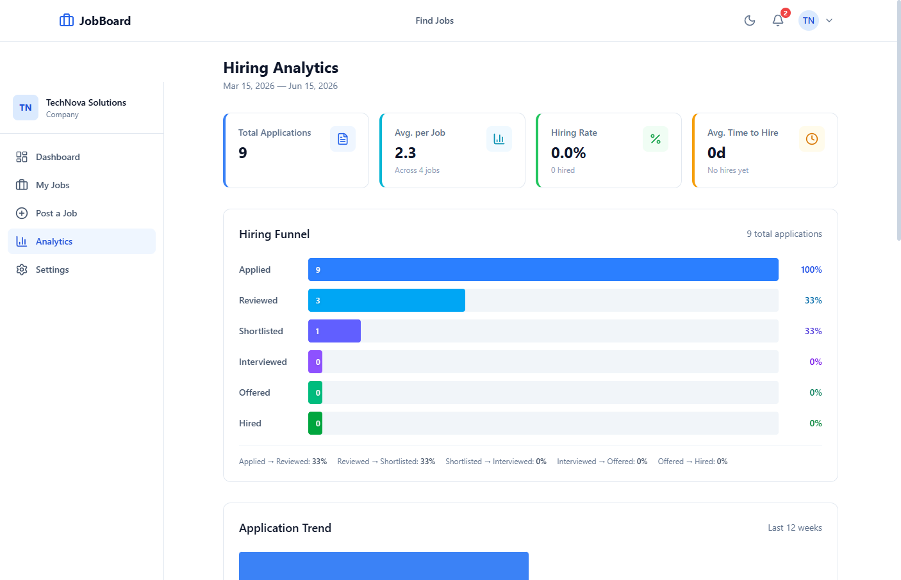</a>
      <sub><b>Analytics</b><br/>Hiring funnel & conversion</sub>
    </td>
    <td align="center" width="33%">
      <a href="./assets/screenshots/admin-dashboard.png">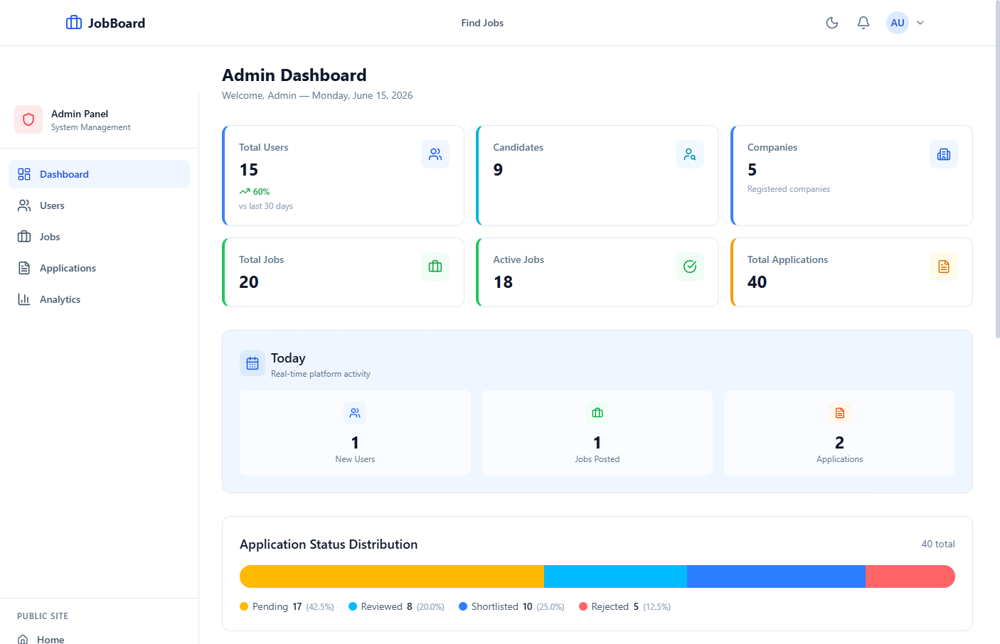</a>
      <sub><b>Admin console</b><br/>Platform-wide management</sub>
    </td>
  </tr>
</table>

> Capture these views from the live deployment and drop them into `assets/screenshots/` using the file names above to render the grid.

---

## Architecture

A high-level visual map of the system. Both diagrams render natively on GitHub thanks to Mermaid support.

### Domain Model

How the core collections relate to each other and how notifications fan out to users.

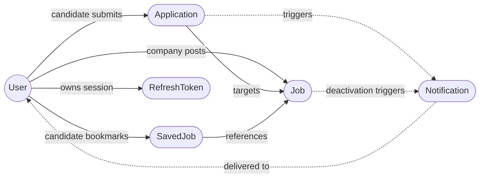

### Request Lifecycle

How a single browser action travels through the stack.

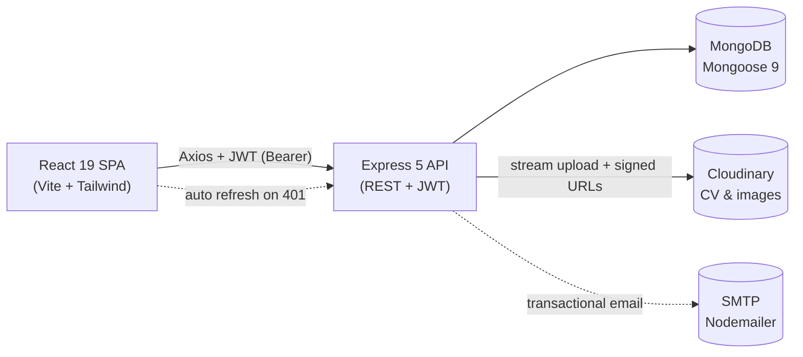

---

## Technologies

### Frontend

- **React 19**: Modern UI library with hooks and functional components
- **React Router 7**: Client-side routing with nested layouts and route guards
- **Vite 8**: Lightning-fast build tool and dev server with HMR
- **Tailwind CSS 4**: Utility-first CSS framework with custom theme tokens and dark mode
- **Axios 1.15**: Promise-based HTTP client with interceptors for automatic token refresh
- **Lucide React**: Clean, consistent icon library
- **React Hot Toast**: Lightweight notification toasts for user feedback

### Backend

- **Node.js**: Server-side JavaScript runtime
- **Express 5**: Fast, minimalist web framework with async error handling
- **MongoDB (Mongoose 9)**: NoSQL database with schema validation, indexes, virtuals, and TTL cleanup
- **JWT (jsonwebtoken 9 + bcryptjs 3)**: Token-based auth with refresh rotation and password hashing
- **Multer 2 + Cloudinary 2.9**: File upload middleware with cloud storage and signed URLs
- **express-validator 7**: Server-side request validation and sanitization
- **Nodemailer 8**: Transactional email service with HTML templates
- **Helmet 8 + CORS + express-rate-limit 8**: HTTP security middleware stack
- **express-mongo-sanitize**: NoSQL injection prevention
- **Swagger (swagger-jsdoc + swagger-ui-express)**: Interactive API documentation at `/api-docs`

---

## Roles & Permissions

| Feature                      | Guest | Candidate | Company | Admin |
| ---------------------------- | :---: | :-------: | :-----: | :---: |
| Browse jobs & view details   |  ✅   |    ✅     |   ✅    |  ✅   |
| View company profiles        |  ✅   |    ✅     |   ✅    |  ✅   |
| Register / Login             |  ✅   |    —      |   —     |  —    |
| Apply to jobs                |  —    |    ✅     |   —     |  —    |
| Save / unsave jobs           |  —    |    ✅     |   —     |  —    |
| View / withdraw applications |  —    |    ✅     |   —     |  —    |
| Edit profile                 |  —    |    ✅     |   ✅    |  ✅   |
| Create / edit / delete jobs  |  —    |    —      |   ✅    |  —    |
| Review job applications      |  —    |    —      |   ✅    |  ✅   |
| Update application status    |  —    |    —      |   ✅    |  ✅   |
| Company analytics            |  —    |    —      |   ✅    |  —    |
| Manage all users / jobs      |  —    |    —      |   —     |  ✅   |
| Platform analytics           |  —    |    —      |   —     |  ✅   |

---

## Installation

### Prerequisites

- **Node.js** v18+ and **npm** ([download](https://nodejs.org/))
- **MongoDB** — [MongoDB Atlas](https://www.mongodb.com/atlas) (free tier) or a [local instance](https://www.mongodb.com/try/download/community)
- **Cloudinary** account — for file uploads ([sign up](https://cloudinary.com/))
- **SMTP credentials** (optional) — for email notifications (e.g., a Gmail App Password)

### Local Development

**1. Clone the repository:**

```bash
git clone https://github.com/Serkanbyx/job-board-with-company-user-dashboard.git
cd job-board-with-company-user-dashboard
```

**2. Set up environment variables:**

```bash
cp server/.env.example server/.env
cp client/.env.example client/.env
```

**server/.env**

```env
PORT=5000
NODE_ENV=development

MONGO_URI=mongodb://localhost:27017/jobboard

JWT_SECRET=your_jwt_secret_min_32_chars_here
ACCESS_TOKEN_TTL=1h

CORS_ORIGIN=http://localhost:5173

CLOUDINARY_CLOUD_NAME=your_cloud_name
CLOUDINARY_API_KEY=your_api_key
CLOUDINARY_API_SECRET=your_api_secret

SMTP_HOST=smtp.gmail.com
SMTP_PORT=587
SMTP_USER=your_email@gmail.com
SMTP_PASS=your_app_password
EMAIL_FROM=JobBoard <noreply@jobboard.com>

CLIENT_URL=http://localhost:5173

# Optional — overrides the default seeded admin (admin@jobboard.com / Admin123!)
ADMIN_EMAIL=admin@jobboard.com
ADMIN_PASSWORD=Admin123!
```

**client/.env**

```env
VITE_API_URL=
```

> **Note:** Leave `VITE_API_URL` empty for development — the Vite proxy forwards `/api` requests to `http://localhost:5000`. Set it to your deployed backend URL for production.

**3. Install dependencies:**

```bash
cd server && npm install
cd ../client && npm install
```

**4. Seed the database:**

```bash
cd server

# Seed an admin user only (uses ADMIN_EMAIL / ADMIN_PASSWORD, or safe defaults)
npm run seed:admin

# OR seed the full demo dataset — admin, companies, jobs, candidates, applications
# NOTE: this wipes existing users, jobs, applications, saved jobs and notifications first
npm run seed
```

**5. Run the application:**

```bash
# Terminal 1 — Backend (port 5000)
cd server && npm run dev

# Terminal 2 — Frontend (port 5173)
cd client && npm run dev
```

Open [http://localhost:5173](http://localhost:5173) in your browser.

### Environment Variables

#### Server (`server/.env`)

| Variable                | Description                          | Required | Example                              |
| ----------------------- | ------------------------------------ | :------: | ------------------------------------ |
| `PORT`                  | Server port                          |    No    | `5000`                               |
| `NODE_ENV`              | Environment mode                     |    No    | `development`                        |
| `MONGO_URI`             | MongoDB connection string            |   Yes    | `mongodb://localhost:27017/jobboard` |
| `JWT_SECRET`            | JWT signing secret (min 32 chars)    |   Yes    | `your_jwt_secret_min_32_chars_here`  |
| `ACCESS_TOKEN_TTL`      | Access token lifetime                |    No    | `1h`                                 |
| `CORS_ORIGIN`           | Allowed frontend origin              |   Yes    | `http://localhost:5173`              |
| `CLOUDINARY_CLOUD_NAME` | Cloudinary cloud name                |   Yes    | `your_cloud_name`                    |
| `CLOUDINARY_API_KEY`    | Cloudinary API key                   |   Yes    | `your_api_key`                       |
| `CLOUDINARY_API_SECRET` | Cloudinary API secret                |   Yes    | `your_api_secret`                    |
| `SMTP_HOST`             | SMTP server host                     |    No    | `smtp.gmail.com`                     |
| `SMTP_PORT`             | SMTP server port                     |    No    | `587`                                |
| `SMTP_USER`             | SMTP username                        |    No    | `your_email@gmail.com`               |
| `SMTP_PASS`             | SMTP password / app password         |    No    | `your_app_password`                  |
| `EMAIL_FROM`            | Sender address                       |    No    | `JobBoard <noreply@jobboard.com>`    |
| `CLIENT_URL`            | Client URL (for email links)         |    No    | `http://localhost:5173`              |
| `ADMIN_EMAIL`           | Seeded admin email override          |    No    | `admin@jobboard.com`                 |
| `ADMIN_PASSWORD`        | Seeded admin password override       |    No    | `Admin123!`                          |

#### Client (`client/.env`)

| Variable       | Description                                 | Required | Example                       |
| -------------- | ------------------------------------------- | :------: | ----------------------------- |
| `VITE_API_URL` | Backend API base URL (empty for dev proxy)  |    No    | _(empty for development)_     |

---

## Usage

1. **Register** as a candidate or company from the registration page
2. **Browse jobs** on the public listing page with advanced multi-dimension filters
3. **Apply to jobs** as a candidate by uploading your CV and writing a cover letter
4. **Track applications** from your candidate dashboard with real-time status updates and a timeline
5. **Save jobs** to your bookmarks for later
6. **Post jobs** as a company and manage them from the company dashboard
7. **Review applications** with the status workflow — add notes, ratings, and bulk-update statuses
8. **View analytics** as a company to see the hiring funnel, trends, and conversion rates
9. **Manage the platform** as an admin — users, jobs, applications, and platform-wide analytics
10. **Customize preferences** — notification settings, profile details, and dark/light theme

---

## How It Works?

### Authentication Flow

The platform uses a dual-token strategy for secure, seamless authentication:

```
Login → Access Token (1 hour) + Refresh Token (7 days, 30 with "Remember me")
       ↓
API Request → Authorization: Bearer <access_token>
       ↓
Token Expired → Auto-refresh via /api/auth/refresh-token
       ↓
Refresh Failed → Redirect to login
```

- **Token rotation**: each refresh token is single-use; a new pair is issued on every refresh
- **Token versioning**: changing or resetting the password invalidates all existing sessions
- **Account lockout**: 5 failed login attempts trigger a 30-minute cooldown

### Application Workflow

```
pending → reviewed → shortlisted → interviewed → offered → hired
                                                         ↘ rejected
                          candidate can withdraw at any early stage ↗
```

Each status transition is recorded with a timestamp, building a visual timeline for both candidates and companies.

### Architecture Overview

- **Frontend**: a React SPA with client-side routing, context-based state management, and Axios interceptors for automatic token refresh
- **Backend**: a RESTful Express API with a layered architecture (routes → validators → controllers → models), 8 specialized rate limiters, and comprehensive audit logging
- **Database**: MongoDB with Mongoose ODM — 7 models with indexes, virtuals, TTL-based cleanup, and compound unique constraints

---

## API Endpoints

### Health Check

| Method | Endpoint      | Auth | Description       |
| ------ | ------------- | :--: | ----------------- |
| GET    | `/api/health` |  No  | API health check  |

### Authentication (`/api/auth`)

| Method | Endpoint                     | Auth | Description                                  |
| ------ | ---------------------------- | :--: | -------------------------------------------- |
| POST   | `/api/auth/register`         |  No  | Register a new user (candidate or company)   |
| POST   | `/api/auth/login`            |  No  | Login and receive a token pair               |
| POST   | `/api/auth/refresh-token`    |  No  | Refresh access token using a refresh token   |
| POST   | `/api/auth/forgot-password`  |  No  | Request a password reset link via email      |
| POST   | `/api/auth/reset-password`   |  No  | Reset password using a valid reset token     |
| POST   | `/api/auth/logout`           | Yes  | Logout and revoke the refresh token          |
| POST   | `/api/auth/logout-all`       | Yes  | Logout all sessions (revoke all tokens)      |
| GET    | `/api/auth/me`               | Yes  | Get the current user's profile               |
| PUT    | `/api/auth/profile`          | Yes  | Update the user profile                      |
| PUT    | `/api/auth/change-password`  | Yes  | Change password (invalidates all sessions)   |
| DELETE | `/api/auth/account`          | Yes  | Delete own account                           |

### Jobs (`/api/jobs`)

| Method | Endpoint                  | Auth          | Description                                   |
| ------ | ------------------------- | :-----------: | --------------------------------------------- |
| GET    | `/api/jobs`               | No            | List jobs with filters and pagination         |
| GET    | `/api/jobs/stats`         | No            | Filter statistics (counts by type, location…) |
| GET    | `/api/jobs/my-jobs`       | Company       | List the company's own job postings           |
| GET    | `/api/jobs/:slug`         | No            | Get job details by slug (or ObjectId)         |
| GET    | `/api/jobs/:slug/similar` | No            | Get similar job recommendations               |
| POST   | `/api/jobs`               | Company       | Create a new job posting                       |
| PUT    | `/api/jobs/:id`           | Company       | Update a job posting                           |
| PATCH  | `/api/jobs/:id/toggle`    | Company       | Toggle job active/inactive status              |
| DELETE | `/api/jobs/:id`           | Company, Admin | Delete a job posting                          |

### Applications (`/api`)

| Method | Endpoint                              | Auth           | Description                            |
| ------ | ------------------------------------- | :------------: | -------------------------------------- |
| POST   | `/api/jobs/:jobId/apply`              | Candidate      | Apply to a job with CV & cover letter  |
| GET    | `/api/applications/mine`              | Candidate      | List own applications                  |
| GET    | `/api/jobs/:jobId/applications`       | Company, Admin | List applications for a specific job   |
| GET    | `/api/jobs/:jobId/applications/stats` | Company, Admin | Application statistics for a job        |
| GET    | `/api/applications/:id`               | Yes            | Get a single application's details     |
| PATCH  | `/api/applications/:id/status`        | Company, Admin | Update application status               |
| PATCH  | `/api/applications/:id/notes`         | Company, Admin | Update internal notes & rating          |
| PATCH  | `/api/applications/bulk-status`       | Company        | Bulk-update application statuses        |
| DELETE | `/api/applications/:id`               | Candidate      | Withdraw an application                 |

### Users (`/api/users`)

| Method | Endpoint                         | Auth           | Description                  |
| ------ | -------------------------------- | :------------: | ---------------------------- |
| GET    | `/api/users/candidate/dashboard` | Candidate      | Candidate dashboard stats    |
| GET    | `/api/users/company/dashboard`   | Company        | Company dashboard stats      |
| GET    | `/api/users/company/analytics`   | Company        | Company hiring analytics     |
| GET    | `/api/users/company/:id`         | No             | Public company profile       |
| GET    | `/api/users/candidate/:id`       | Company, Admin | View a candidate profile     |

### Saved Jobs (`/api/saved-jobs`)

| Method | Endpoint                  | Auth      | Description                  |
| ------ | ------------------------- | :-------: | ---------------------------- |
| GET    | `/api/saved-jobs`         | Candidate | List saved jobs              |
| GET    | `/api/saved-jobs/check`   | Candidate | Check saved status (batch)   |
| POST   | `/api/saved-jobs/:jobId`  | Candidate | Toggle save/unsave a job     |

### Notifications (`/api/notifications`)

| Method | Endpoint                          | Auth | Description                       |
| ------ | --------------------------------- | :--: | --------------------------------- |
| GET    | `/api/notifications`              | Yes  | List notifications                |
| GET    | `/api/notifications/unread-count` | Yes  | Get unread notification count     |
| PATCH  | `/api/notifications/read-all`     | Yes  | Mark all notifications as read    |
| PATCH  | `/api/notifications/:id/read`     | Yes  | Mark a single notification read   |
| DELETE | `/api/notifications/:id`          | Yes  | Delete a notification             |

### Uploads (`/api/upload`)

| Method | Endpoint                    | Auth      | Description                          |
| ------ | --------------------------- | :-------: | ------------------------------------ |
| POST   | `/api/upload/cv`            | Candidate | Upload a CV (PDF, max 5MB)           |
| POST   | `/api/upload/image`         | Yes       | Upload an avatar/logo image (max 2MB) |
| GET    | `/api/upload/cv/signed-url` | Yes       | Get a signed Cloudinary CV URL        |
| DELETE | `/api/upload`               | Yes       | Delete an uploaded file               |

### Admin (`/api/admin`)

| Method | Endpoint                        | Auth  | Description                  |
| ------ | ------------------------------- | :---: | ---------------------------- |
| GET    | `/api/admin/dashboard`          | Admin | Admin dashboard statistics   |
| GET    | `/api/admin/analytics`          | Admin | Platform-wide analytics      |
| GET    | `/api/admin/users`              | Admin | List all users with filters  |
| GET    | `/api/admin/users/:id`          | Admin | Get user details             |
| PATCH  | `/api/admin/users/:id/status`   | Admin | Toggle user active status    |
| PATCH  | `/api/admin/users/:id/role`     | Admin | Change a user's role         |
| DELETE | `/api/admin/users/:id`          | Admin | Delete a user                |
| GET    | `/api/admin/jobs`               | Admin | List all jobs                |
| PATCH  | `/api/admin/jobs/:id/featured`  | Admin | Toggle job featured status   |
| PATCH  | `/api/admin/jobs/:id/active`    | Admin | Toggle job active status     |
| DELETE | `/api/admin/jobs/:id`           | Admin | Delete a job                 |
| GET    | `/api/admin/applications`       | Admin | List all applications        |

> Authenticated endpoints require an `Authorization: Bearer <token>` header. Interactive API documentation is available at `/api-docs` (Swagger UI).

---

## Project Structure

A clean monorepo layout with an explicit backend / frontend split. Each panel below is collapsible — expand the one you care about.

<details open>
<summary><b>Server</b> — Express 5 API</summary>

```
server/
├── config/            # env validation, db, swagger, email transporter
├── controllers/       # auth, job, application, user, savedJob, notification, upload, admin
├── middlewares/       # auth, rateLimiter, validate, errorHandler, requestId, securityHeaders, sanitize, auditLogger, upload
├── models/            # User, Job, Application, Notification, RefreshToken, SavedJob, AuditLog
├── routes/            # auth, jobs, applications, users, saved-jobs, notifications, upload, admin
├── services/          # emailService
├── templates/emails/  # baseTemplate, welcome, applicationReceived, statusUpdate, passwordReset
├── utils/             # apiResponse, cloudinary, createNotification, escapeRegex, fileValidator, generateToken
├── validators/        # auth, job, application, admin, savedJob
├── seed/              # seed.js (full demo data, or admin-only via --admin-only)
├── index.js           # Express app composition + startup
├── .env.example
└── package.json
```

</details>

<details>
<summary><b>Client</b> — React 19 + Vite SPA</summary>

```
client/
├── public/            # favicon.svg, icons.svg, _redirects (Netlify SPA rules)
├── src/
│   ├── api/           # axiosInstance + per-resource service wrappers
│   ├── components/    # common, guards, layout, jobs, applications, notifications
│   ├── contexts/      # Auth, Notification, Preferences, Sidebar (+ instance files)
│   ├── hooks/         # useAuth, useNotifications, usePreferences, useSidebar, useDebounce…
│   ├── pages/         # auth, public, candidate, company, admin, settings
│   ├── utils/         # constants, formatDate, helpers
│   ├── App.jsx        # route definitions + layouts
│   ├── main.jsx       # React bootstrap + providers
│   └── index.css      # Tailwind v4 imports + theme tokens
├── .env.example
├── vite.config.js
├── eslint.config.js
└── package.json
```

</details>

<details>
<summary><b>Repository root</b> — governance & shared config</summary>

```
job-board-with-company-user-dashboard/
├── client/            # → see Client panel above
├── server/            # → see Server panel above
├── .github/           # issue templates, PR template, CODE_OF_CONDUCT, CONTRIBUTING, SECURITY
├── LICENSE
└── README.md
```

</details>

---

## Security

- **JWT Dual-Token Strategy** — Access tokens (1-hour expiry) with single-use refresh tokens (7-day rotation, 30 days with "Remember me") and token versioning
- **Password Hashing** — bcrypt with 12 salt rounds and password-history tracking to prevent reuse
- **Password Reset** — SHA-256 hashed, single-use, time-limited reset tokens with session invalidation on success
- **Account Lockout** — Automatic lockout after 5 failed login attempts with a 30-minute cooldown
- **Role-Based Access Control** — Server-side `requireRole` middleware + 5 client-side route guard components
- **Helmet CSP** — Strict Content Security Policy, HSTS with preload, X-Content-Type-Options, X-Frame-Options
- **CORS Whitelist** — Strict origin validation from environment configuration
- **8 Specialized Rate Limiters** — Global, auth, password, refresh, upload, application, admin, and sensitive-operation limiters
- **Input Validation** — Server-side request validation via express-validator with sanitization
- **NoSQL Injection Prevention** — MongoDB query sanitization via express-mongo-sanitize
- **Request Body Limits** — 10KB size restriction on JSON / URL-encoded payloads
- **File Security** — Magic-byte type validation (not just extension), EXIF stripping, signed Cloudinary URLs, per-type size limits
- **Audit Logging** — Comprehensive logging (action, user, IP, user-agent, method, path, status) with TTL-based 90-day retention
- **Request Tracking** — UUID-based `X-Request-Id` header on every request

---

## Deployment

### Backend (Render)

1. Create a **Web Service** on [Render](https://render.com/) from the `server/` directory
2. Set **Build Command** to `npm install`
3. Set **Start Command** to `node index.js`
4. Configure environment variables:

| Variable                | Value                                |
| ----------------------- | ------------------------------------ |
| `NODE_ENV`              | `production`                         |
| `MONGO_URI`             | Your MongoDB Atlas connection string |
| `JWT_SECRET`            | Strong random string (min 32 chars)  |
| `CORS_ORIGIN`           | Your Netlify frontend URL            |
| `CLOUDINARY_CLOUD_NAME` | Your Cloudinary cloud name           |
| `CLOUDINARY_API_KEY`    | Your Cloudinary API key              |
| `CLOUDINARY_API_SECRET` | Your Cloudinary API secret           |
| `CLIENT_URL`            | Your Netlify frontend URL            |

> Configure the `SMTP_*` variables if you want email notifications and password-reset emails enabled.

### Frontend (Netlify)

1. Deploy the `client/` directory on [Netlify](https://www.netlify.com/)
2. Set **Build Command** to `npm run build`
3. Set **Publish Directory** to `dist`
4. Configure environment variables:

| Variable       | Value                                                           |
| -------------- | --------------------------------------------------------------- |
| `VITE_API_URL` | Your Render backend URL (e.g., `https://your-api.onrender.com`) |

> The `_redirects` file in `client/public/` handles SPA routing on Netlify automatically.

### Database (MongoDB Atlas)

1. Create a free cluster on [MongoDB Atlas](https://www.mongodb.com/atlas)
2. Whitelist your Render service IP (or `0.0.0.0/0` for dynamic IPs)
3. Create a database user and copy the connection string
4. Paste the connection string as `MONGO_URI` in your Render environment

---

## Features in Detail

### Completed Features

- ✅ JWT authentication with access + refresh token rotation
- ✅ Self-service forgot/reset password flow
- ✅ Role-based dashboards (Candidate, Company, Admin)
- ✅ Advanced job search with multi-dimension filtering
- ✅ Multi-state application workflow with timeline
- ✅ File uploads via Cloudinary (CV + images)
- ✅ In-app notification system with polling
- ✅ Transactional email notifications via Nodemailer
- ✅ Company hiring analytics (funnel, trends, rates)
- ✅ Profile completion tracker for candidates
- ✅ Dark mode with system/light/dark toggle
- ✅ Responsive mobile-first design
- ✅ Swagger API documentation
- ✅ Security hardening (Helmet, rate limiting, sanitization)
- ✅ Audit logging with 90-day TTL retention
- ✅ Demo data seeder for testing

### Future Features

- 🔮 [ ] Real-time notifications via WebSocket
- 🔮 [ ] Advanced resume parsing with AI
- 🔮 [ ] Interview scheduling integration
- 🔮 [ ] Multi-language support (i18n)
- 🔮 [ ] Two-factor authentication (2FA)
- 🔮 [ ] Social login (Google, LinkedIn, GitHub)

---

## Contributing

1. **Fork** the repository
2. **Clone** your fork: `git clone https://github.com/your-username/job-board-with-company-user-dashboard.git`
3. **Create** a feature branch: `git checkout -b feat/amazing-feature`
4. **Commit** your changes with conventional commit messages
5. **Push** to your branch: `git push origin feat/amazing-feature`
6. **Open** a Pull Request

### Commit Message Format

| Prefix      | Description                        |
| ----------- | ---------------------------------- |
| `feat:`     | New feature                        |
| `fix:`      | Bug fix                            |
| `refactor:` | Code refactoring                   |
| `docs:`     | Documentation changes              |
| `chore:`    | Maintenance and dependency updates |

> See [CONTRIBUTING.md](.github/CONTRIBUTING.md) and the [Code of Conduct](.github/CODE_OF_CONDUCT.md) for full details. The repository contains **no secrets** — all sensitive configuration is via environment variables. Create your own `.env` files from the `.env.example` templates.

---

## License

This project is licensed under the [MIT License](LICENSE).

---

## Developer

**Serkan Bayraktar**

- 🌐 Website: [serkanbayraktar.com](https://serkanbayraktar.com/)
- 💻 GitHub: [@Serkanbyx](https://github.com/Serkanbyx)
- 📧 Email: [serkanbyx1@gmail.com](mailto:serkanbyx1@gmail.com)

---

## Acknowledgments

- [React](https://react.dev/) — UI library
- [Express](https://expressjs.com/) — Web framework
- [MongoDB](https://www.mongodb.com/) — Database
- [Tailwind CSS](https://tailwindcss.com/) — CSS framework
- [Vite](https://vite.dev/) — Build tool
- [Cloudinary](https://cloudinary.com/) — Cloud file storage
- [Lucide](https://lucide.dev/) — Icon library
- [Swagger](https://swagger.io/) — API documentation

---

## Contact

- [Open an Issue](https://github.com/Serkanbyx/job-board-with-company-user-dashboard/issues)
- Email: [serkanbyx1@gmail.com](mailto:serkanbyx1@gmail.com)
- Website: [serkanbayraktar.com](https://serkanbayraktar.com/)

---

⭐ If you like this project, don't forget to give it a star!
