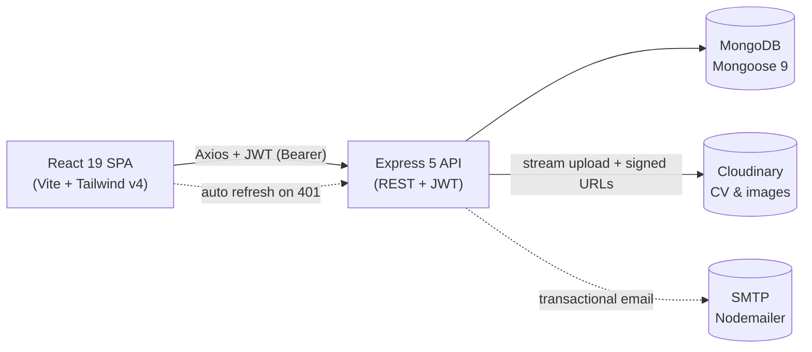

# Job Board with Company & User Dashboard — Step-by-Step Build Guide

> **Archived: original build playbook.** This document is the original roadmap used to build the project from an empty folder to a deployed full-stack application. It is preserved as a "making-of" reference. The codebase may have evolved since this guide was written, so treat the steps as the intended path rather than a line-by-line description of the current source. For current setup, architecture, and deployment notes, see [../README.md](../README.md).

---

> **Project Summary:** A full-stack MERN job board with three first-class roles — candidate, company, and admin — each with a dedicated dashboard. Candidates search jobs with multi-dimension filters, upload a CV, apply, save jobs, and track applications through a status timeline. Companies post and manage jobs, review applications with a hiring workflow (notes, ratings, bulk status updates), and view analytics. Admins manage all users, jobs, and applications plus platform-wide analytics. Security is layered: JWT access/refresh token rotation with token versioning, account lockout, bcrypt password history, Helmet CSP, eight specialized rate limiters, NoSQL-injection sanitization, magic-byte file validation, signed Cloudinary URLs, and TTL-based audit logging. The stack is React 19 + Vite + Tailwind v4 on the client and Express 5 + Mongoose 9 + MongoDB on the server, documented with Swagger/OpenAPI.

Each step below is a self-contained prompt. Execute them in order.

Stack: React 19, React Router 7, Vite 8, Tailwind CSS 4, Axios, Express 5, Mongoose 9, MongoDB, JWT, Cloudinary, Nodemailer, Swagger.

---

## Table of Contents

**PHASE 1 — Backend Foundation**

- STEP 1 — Project Scaffolding & Dependency Setup
- STEP 2 — Environment, Config & Database Connection
- STEP 3 — Security Middleware Stack
- STEP 4 — Error Handling, API Response & Shared Utilities

**PHASE 2 — Backend Resources**

- STEP 5 — User Model & Authentication (JWT + Refresh Rotation)
- STEP 6 — Password Reset Flow & Email Service
- STEP 7 — Job Model, Search & CRUD
- STEP 8 — Application Model & Hiring Workflow
- STEP 9 — Saved Jobs & Notifications
- STEP 10 — File Uploads (Cloudinary)
- STEP 11 — Admin Module & Analytics
- STEP 12 — Database Seeder & Swagger Docs

**PHASE 3 — Client Foundation**

- STEP 13 — Client Scaffolding, Tailwind & Theme Tokens
- STEP 14 — Axios Instance & Auto Token Refresh
- STEP 15 — Contexts (Auth, Notification, Preferences, Sidebar)
- STEP 16 — Route Guards & Layouts
- STEP 17 — Common UI Component Library

**PHASE 4 — Client Pages**

- STEP 18 — Public Pages (Home, Job List, Job Detail, Company Profile)
- STEP 19 — Auth Pages (Login, Register, Forgot/Reset Password)
- STEP 20 — Candidate Dashboard (Applications, Saved Jobs)
- STEP 21 — Company Dashboard (Jobs, Applications, Analytics)
- STEP 22 — Admin Dashboard (Users, Jobs, Applications, Analytics)
- STEP 23 — Settings (Profile, Account, Notifications)

**PHASE 5 — Polish & Deploy**

- STEP 24 — Notifications UI & Dark Mode
- STEP 25 — Accessibility, Performance & Error Boundaries
- STEP 26 — Deployment (Render + Netlify + MongoDB Atlas)

**Appendices**

- Appendix A — Shared Constants & Environment Variables
- Appendix B — API Response & Error Conventions
- Appendix C — Security Checklist
- Appendix D — Common Pitfalls
- Appendix E — Pre-flight Checklist

---

## Global Build Rules (apply to EVERY step)

- **No git operations.** Do not run `git init`, `add`, `commit`, `push`, `branch`, or any other `git` command. Version control is handled manually by the user.
- **No unapproved packages.** Only install the dependencies named in a step. Prefer native methods over new dependencies.
- **No long-running processes** (dev servers, watchers, seeders) unless the step explicitly requests it.
- **Treat every step as self-contained.** Re-read the relevant files before editing; do not assume in-memory state from a previous step.
- **Code quality.** Clean, readable, commented where intent is non-obvious. English identifiers in `camelCase`. Modern syntax (ES6+, hooks, async/await).
- **Security first.** Validate and sanitize all input server-side, never trust the client, never log secrets, keep all credentials in environment variables.
- **Accessibility & performance** are acceptance criteria, not afterthoughts: semantic HTML, keyboard support, focus management, and lazy/debounced data fetching where relevant.
- **Consistency.** Reuse the established API response envelope, error classes, and validation patterns (see appendices) instead of inventing new ones.

---

## Architecture at a Glance

A single browser action flows from the React SPA through the Express API, into MongoDB, and out to third-party services (Cloudinary, SMTP). The client holds a short-lived access token in memory and transparently refreshes it.



The server is a layered pipeline: `requestId → Helmet/CSP → securityHeaders → CORS → body parse → mongo-sanitize → global rate limit → audit log → Swagger → routes → 404 → error handler`. Each resource follows `routes → validators → controllers → models`.

---

# PHASE 1 — BACKEND FOUNDATION

---

## STEP 1 — Project Scaffolding & Dependency Setup

**Goal:** Create the monorepo layout and initialize the Express server package.

**Files/folders to create:**

```
job-board-with-company-user-dashboard/
├── server/
│   ├── config/ controllers/ middlewares/ models/ routes/
│   ├── services/ templates/emails/ utils/ validators/ seed/
│   ├── index.js
│   ├── .env.example
│   └── package.json
└── client/   (scaffolded in STEP 13)
```

**Dependencies (server):**

```bash
cd server
npm init -y
npm install express@^5 mongoose@^9 jsonwebtoken@^9 bcryptjs@^3 \
  cors helmet express-rate-limit express-validator express-mongo-sanitize \
  multer cloudinary nodemailer dotenv file-type \
  swagger-jsdoc swagger-ui-express
npm install --save-dev nodemon
```

**Implementation notes:**

- Set `"type": "module"` in `server/package.json` (the codebase uses native ESM imports).
- Add scripts: `dev` (`nodemon index.js`), `start` (`node index.js`), `build` (`npm install`), `seed` (`node seed/seed.js`), `seed:admin` (`node seed/seed.js --admin-only`).
- Do **not** put a destructive seed in the `build` script.

**Acceptance:** `npm run dev` starts (even with an empty `index.js`) and folders exist.

---

## STEP 2 — Environment, Config & Database Connection

**Goal:** Centralize configuration with validation and connect to MongoDB.

**Files to create:** `config/env.js`, `config/db.js`, `.env.example`.

**Implementation notes:**

- `config/env.js`: load `dotenv`, read every variable through one module, fail fast on missing required values (`MONGO_URI`, `JWT_SECRET`, `CORS_ORIGIN`, Cloudinary keys). Provide sensible defaults (`PORT=5000`, `ACCESS_TOKEN_TTL=1h`, `NODE_ENV=development`).
- `config/db.js`: `connectDB()` connects via Mongoose, logs success, and exits the process on failure.
- Mirror every variable in `.env.example` with placeholder values and an inline comment. See [Appendix A](#appendix-a--shared-constants--environment-variables).

**Security:** never commit a real `.env`; keep `.env` in `.gitignore`. Generate `JWT_SECRET` with `node -e "console.log(require('crypto').randomBytes(32).toString('hex'))"`.

**Acceptance:** booting the server logs a successful DB connection; missing env vars produce a clear startup error.

---

## STEP 3 — Security Middleware Stack

**Goal:** Build the hardening layer that wraps all routes.

**Files to create:** `middlewares/requestId.js`, `securityHeaders.js`, `sanitize.js`, `rateLimiter.js`, `auditLogger.js`.

**Implementation notes:**

- `requestId`: attach a UUID to each request and echo it in an `X-Request-Id` response header.
- `securityHeaders`: supplement Helmet with any custom headers; configure Helmet CSP in `index.js` (allow Cloudinary images, relax inline for Swagger UI), HSTS with preload, strict referrer policy.
- `sanitize`: Express-5-safe wrapper around `express-mongo-sanitize` for `body` and `params` (do not reassign `req.query`, which is read-only in Express 5).
- `rateLimiter`: export **eight** named limiters — `globalLimiter`, `authLimiter`, `passwordLimiter`, `refreshLimiter`, `uploadLimiter`, `applicationLimiter`, `adminLimiter`, `sensitiveLimiter` — each with appropriate windows/limits and standard headers.
- `auditLogger`: persist `{ action, user, ip, userAgent, method, path, statusCode }` to the `AuditLog` model (created in STEP 11) without blocking the response.
- CORS: strict origin validation against `CORS_ORIGIN` with a callback validator; `credentials: true`; expose `X-Request-Id` and rate-limit headers.
- Body parsers limited to `10kb`.

**Acceptance:** responses carry security headers and `X-Request-Id`; exceeding a limiter returns `429` with a JSON error.

---

## STEP 4 — Error Handling, API Response & Shared Utilities

**Goal:** Standardize responses and centralize error handling.

**Files to create:** `utils/apiResponse.js`, `middlewares/errorHandler.js`, `middlewares/validate.js`, plus utils `escapeRegex.js`, `generateToken.js`.

**Implementation notes:**

- `apiResponse.js`: export `sendSuccess(res, data, message, status)`, `sendError(res, message, status, errors)`, and `sendPaginated(res, data, pagination, message)`. Every endpoint returns this envelope (see [Appendix B](#appendix-b--api-response--error-conventions)).
- `errorHandler.js`: last middleware; normalize Mongoose `ValidationError`/`CastError`/duplicate-key (`11000`), JWT errors, and Multer errors into clean status codes; hide stack traces in production.
- `validate.js`: run `express-validator`'s `validationResult`; on failure respond `422` with a field-error array.
- `escapeRegex.js`: escape user input before building `RegExp` for search.
- `generateToken.js`: helpers to sign access tokens and create/hash refresh tokens.

**Acceptance:** a deliberately invalid request returns a consistent `422` envelope; thrown errors never leak stack traces in production mode.

---

# PHASE 2 — BACKEND RESOURCES

---

## STEP 5 — User Model & Authentication (JWT + Refresh Rotation)

**Goal:** Implement registration, login, and the dual-token strategy.

**Files to create:** `models/User.js`, `models/RefreshToken.js`, `controllers/authController.js`, `routes/authRoutes.js`, `validators/authValidator.js`, `middlewares/auth.js`.

**Implementation notes:**

- `User` schema: `email` (unique, lowercased), `password` (`select: false`), `role` (`candidate | company | admin`), shared profile fields plus role-specific fields (candidate: `experience`, `education`, `skills`, `cv`; company: `companyName`, `website`, `industry`, `logo`). Add `tokenVersion`, `failedLoginAttempts`, `lockUntil`, `passwordHistory`, `passwordChangedAt`. Hash with bcrypt (12 rounds) in a `pre('save')` hook; add `comparePassword` and a profile-completion virtual.
- `RefreshToken` schema: hashed token, `user`, `expiresAt` (TTL index), `userAgent`/`ip`, `revoked` flag.
- Auth flow: `register`, `login` (with account lockout after 5 failures → 30-min `lockUntil`), `refreshToken` (single-use rotation — revoke old, issue new pair), `logout`, `logoutAll`, `getMe`, `updateProfile`, `changePassword` (bump `tokenVersion`, check `passwordHistory`), `deleteAccount`.
- Access token TTL `1h`; refresh `7d` (or `30d` with "Remember me").
- `auth` middleware: verify access token, load user, compare `tokenVersion`, attach `req.user`; `requireRole(...roles)` for RBAC.
- Apply `authLimiter` to login/register and `refreshLimiter` to refresh.

**Acceptance:** register → login returns a token pair; an expired access token can be refreshed once; changing the password invalidates all old sessions.

---

## STEP 6 — Password Reset Flow & Email Service

**Goal:** Self-service forgot/reset password with emailed tokens.

**Files to create/edit:** `services/emailService.js`, `config/email.js`, `templates/emails/baseTemplate.js` + `passwordResetEmail.js` (+ `welcomeEmail`, `applicationReceivedEmail`, `statusUpdateEmail`), extend `authController.js`, `authValidator.js`, `authRoutes.js`, and `User.js`.

**Implementation notes:**

- Add `passwordResetToken` and `passwordResetExpires` (`select: false`) to `User`.
- `forgotPassword`: generate a random token, store only its SHA-256 hash + 15-min expiry, email a link to `${CLIENT_URL}/reset-password/:token`. Always respond with a generic success message to prevent user enumeration; don't persist the token if the email send fails.
- `resetPassword`: hash the incoming token, find an unexpired match, enforce password-history reuse rules, set the new password, bump `tokenVersion`, clear reset fields, and revoke all refresh tokens.
- `config/email.js`: create the Nodemailer transporter (`secure: Number(SMTP_PORT) === 465`); export `verifyConnection()` (skips gracefully when SMTP isn't configured).
- Apply `passwordLimiter` to both endpoints.

**Acceptance:** requesting a reset sends an email; the link sets a new password once and logs out all sessions; reused/expired tokens are rejected.

---

## STEP 7 — Job Model, Search & CRUD

**Goal:** Job postings with rich, filterable search.

**Files to create:** `models/Job.js`, `controllers/jobController.js`, `routes/jobRoutes.js`, `validators/jobValidator.js`.

**Implementation notes:**

- `Job` schema: `title`, unique `slug`, `company` (ref User), `description`, `requirements`, `location`, `type`, `experienceLevel`, `educationLevel`, `salaryMin`/`salaryMax`, `skills[]`, `industry`, `isActive`, `isFeatured`, `applicationCount`, `viewCount`. Add a text index plus compound indexes for common filters.
- `getJobs`: parse query filters (keyword via escaped regex/text, location, type, experience, education, salary range, skills, industry), sort options, and pagination → `sendPaginated`.
- Also: `getJobStats`, `getMyJobs` (company), `getJobBySlug` (accept slug **or** ObjectId, increment `viewCount`), `getSimilarJobs` (same slug-or-ObjectId lookup), `createJob`, `updateJob`, `toggleJobStatus`, `deleteJob`.
- Generate the slug from the title with a uniqueness suffix; restrict create/update/delete to the owning company (admin may delete).

**Acceptance:** filtered, paginated search works; a company sees only its own jobs in `my-jobs`; slug and ObjectId both resolve a job.

---

## STEP 8 — Application Model & Hiring Workflow

**Goal:** End-to-end application lifecycle with a status timeline.

**Files to create:** `models/Application.js`, `controllers/applicationController.js`, `routes/applicationRoutes.js`, `validators/applicationValidator.js`.

**Implementation notes:**

- `Application` schema: `job`, `candidate`, `coverLetter`, `cv`, `status` (`pending → reviewed → shortlisted → interviewed → offered → hired`, plus `rejected`/`withdrawn`), `statusHistory[]` (`status`, `changedAt`, `changedBy`), `statusNote`, `rating`. Compound unique index on `{ job, candidate }`.
- `pre('save')`: seed `statusHistory` only when new **and** empty (so seeded history is preserved).
- Endpoints: `applyToJob` (candidate; increments `Job.applicationCount`, emails the company, blocks duplicates), `getMyApplications`, `getJobApplications` (company/admin, with `resolveApplicationSort`), `getApplicationStats`, `getApplication`, `updateApplicationStatus` (persist `statusNote`, push history, notify candidate), `updateApplicationNotes`, `bulkUpdateStatus` (persist notes + emit a notification per candidate), `withdrawApplication`.
- Apply `applicationLimiter` to the apply endpoint.

**Acceptance:** a candidate can apply once and withdraw; a company can move an application through the pipeline and bulk-update; every transition appears in the timeline and notifies the candidate.

---

## STEP 9 — Saved Jobs & Notifications

**Goal:** Bookmarking and in-app notifications.

**Files to create:** `models/SavedJob.js`, `models/Notification.js`, their controllers/routes, and `utils/createNotification.js`.

**Implementation notes:**

- `SavedJob`: `{ user, job }` with a compound unique index. Endpoints: list, batch `check`, and `toggle`.
- `Notification`: `user`, `type`, `title`, `message`, `link`, `isRead`. Endpoints: list, `unread-count`, mark one/all read, delete.
- `createNotification` helper centralizes creation and is reused by the application workflow.

**Acceptance:** toggling save/unsave is idempotent per user/job; status changes create notifications and the unread count updates.

---

## STEP 10 — File Uploads (Cloudinary)

**Goal:** Secure CV and image uploads.

**Files to create:** `middlewares/upload.js`, `controllers/uploadController.js`, `routes/uploadRoutes.js`, `utils/cloudinary.js`, `utils/fileValidator.js`.

**Implementation notes:**

- Multer memory storage; validate by **magic bytes** (via `file-type`), not just extension. CV: PDF only, ≤ 5MB. Image: jpeg/png/webp, ≤ 2MB, strip EXIF.
- Stream the buffer to Cloudinary into role-appropriate folders; store the resulting URL/public-id on the user or application.
- `getSignedUrl` for time-limited CV access; `deleteFile` removes from Cloudinary.
- Apply `uploadLimiter`.

**Acceptance:** a renamed `.exe` posing as a PDF is rejected; uploaded CVs are retrievable only via a signed URL.

---

## STEP 11 — Admin Module & Analytics

**Goal:** Platform administration and the audit trail.

**Files to create:** `models/AuditLog.js`, `controllers/adminController.js`, `routes/adminRoutes.js`, `validators/adminValidator.js`.

**Implementation notes:**

- `AuditLog`: fields from STEP 3 with a TTL index (90-day retention).
- Endpoints (all `requireRole('admin')` + `adminLimiter`): `dashboard`, `analytics`, list/get users, toggle user status, change role, delete user, list jobs, toggle featured, toggle active, delete job, list applications.
- Use aggregation pipelines for analytics (counts by role/status, trends over time, conversion rates). Guard against an admin deactivating or deleting themselves.

**Acceptance:** admin endpoints reject non-admins with `403`; sensitive actions appear in `AuditLog`.

---

## STEP 12 — Database Seeder & Swagger Docs

**Goal:** Reproducible demo data and interactive API docs.

**Files to create:** `seed/seed.js`, `config/swagger.js`.

**Implementation notes:**

- `seed.js`: support `--admin-only`. Admin-only mode uses `ADMIN_EMAIL`/`ADMIN_PASSWORD` or safe defaults (`admin@jobboard.com` / `Admin123!`) with a warning — never a hard exit. Full mode wipes users/jobs/applications/saved-jobs/notifications, then inserts admin + companies + jobs + candidates + applications (with realistic `statusHistory`).
- `config/swagger.js`: OpenAPI 3.0 spec with security schemes, shared schemas, and per-endpoint docs (including `forgot-password`, `reset-password`, and admin `jobs/:id/active`). Serve Swagger UI at `/api-docs` via `setupSwagger(app)`.

**Acceptance:** `npm run seed` populates a browsable dataset; `/api-docs` renders and the test accounts log in.

---

# PHASE 3 — CLIENT FOUNDATION

---

## STEP 13 — Client Scaffolding, Tailwind & Theme Tokens

**Goal:** Bootstrap the React SPA with Tailwind v4 and the dev proxy.

**Dependencies (client):**

```bash
npm create vite@latest client -- --template react
cd client
npm install react-router-dom axios react-hot-toast lucide-react
npm install --save-dev tailwindcss @tailwindcss/vite eslint
```

**Implementation notes:**

- Use the `@tailwindcss/vite` plugin; import Tailwind in `src/index.css` and define theme tokens (colors, radius) plus a `dark` variant strategy.
- `vite.config.js`: dev server on `5173` with a proxy forwarding `/api` → `http://localhost:5000`.
- `client/.env.example`: `VITE_API_URL=` (empty in dev so the proxy handles it; set to the deployed API in prod).
- Add `public/_redirects` (`/* /index.html 200`) for Netlify SPA routing.

**Acceptance:** `npm run dev` serves a Tailwind-styled page; `/api/health` is reachable through the proxy.

---

## STEP 14 — Axios Instance & Auto Token Refresh

**Goal:** A single HTTP client that transparently refreshes tokens.

**Files to create:** `src/api/axiosInstance.js` and per-resource service wrappers (`authService.js`, `jobService.js`, `applicationService.js`, `userService.js`, `savedJobService.js`, `notificationService.js`, `uploadService.js`, `adminService.js`).

**Implementation notes:**

- Base URL from `VITE_API_URL` (fallback `/api`). Request interceptor attaches `Authorization: Bearer <accessToken>`.
- Response interceptor: on `401`, attempt a single `/auth/refresh-token`, queue concurrent failed requests, replay them on success, and redirect to `/login` on failure. Guard against infinite refresh loops.
- Services return the parsed envelope so callers read `res.data` / `res.pagination` consistently.

**Acceptance:** an expired access token is refreshed without the user noticing; a hard refresh failure cleanly logs out.

---

## STEP 15 — Contexts (Auth, Notification, Preferences, Sidebar)

**Goal:** Global state via the Context API.

**Files to create:** `src/contexts/AuthContext.jsx`, `NotificationContext.jsx`, `PreferencesContext.jsx`, `SidebarContext.jsx` and matching `src/hooks/useAuth.js`, `useNotifications.js`, `usePreferences.js`, `useSidebar.js` (plus `useDebounce`, `useLocalStorage`, `usePagination`, `useLockBodyScroll`).

**Implementation notes:**

- `AuthContext`: holds the user + access token, exposes `login`/`register`/`logout`/`refreshUser`, bootstraps via `/auth/me` on load, and stores the access token in memory (not `localStorage`) for XSS safety.
- `NotificationContext`: polls `unread-count` on an interval and exposes list/mark-read actions.
- `PreferencesContext`: theme (`system | light | dark`) persisted to `localStorage`, applied to the `<html>` class.
- `SidebarContext`: open/collapsed state for dashboard layouts.

**Acceptance:** refreshing the page keeps the user logged in (via refresh token) and preserves the theme.

---

## STEP 16 — Route Guards & Layouts

**Goal:** Role-aware routing shells.

**Files to create:** guards `ProtectedRoute`, `GuestOnlyRoute`, `CandidateRoute`, `CompanyRoute`, `AdminRoute`; layouts `MainLayout`, `CandidateLayout`, `CompanyLayout`, `AdminLayout`, `SettingsLayout`; plus `Navbar`, `Footer`, sidebars.

**Implementation notes:**

- Guards read `useAuth`, show a spinner while bootstrapping, then redirect: unauthenticated → `/login`; wrong role → that role's dashboard or 404; guests hitting auth pages while logged in → their dashboard.
- Compose routes exactly as in `App.jsx`: public under `MainLayout`; guest routes under `GuestOnlyRoute`; role areas nested `RoleRoute → MainLayout → RoleLayout`; settings under `ProtectedRoute`. Add `ScrollToTop` and the toast `<Toaster />`.

**Acceptance:** deep-linking to a protected route while logged out redirects to login and returns afterward; cross-role access is blocked.

---

## STEP 17 — Common UI Component Library

**Goal:** Reusable, accessible primitives used across pages.

**Files to create (in `src/components/common/`):** `Spinner`, `EmptyState`, `Pagination`, `StatCard`, `StatusBadge`, `RoleBadge`, `SearchInput`, `TagInput`, `ToggleSwitch`, `CharacterCounter`, `ConfirmModal`, `ModalPortal`, `ActionsMenu`, `SkeletonCard`, `SkeletonTable`, `ErrorBoundary`, `ScrollToTop`, `SocialIcons`, `JobCard`.

**Implementation notes:**

- Build modals through a `ModalPortal` with focus trapping, `Escape` to close, and body-scroll lock (`useLockBodyScroll`).
- Provide skeleton loaders for every async list/grid. Keep all interactive elements keyboard-reachable with visible focus rings and ARIA labels.

**Acceptance:** components render in isolation, are keyboard-operable, and are reused (no duplicated one-off UI).

---

# PHASE 4 — CLIENT PAGES

---

## STEP 18 — Public Pages (Home, Job List, Job Detail, Company Profile)

**Goal:** The anonymous discovery surface.

**Files to create:** `pages/public/HomePage`, `JobListPage`, `JobDetailPage`, `CompanyProfilePage`, `AboutPage`, `ContactPage`, `PrivacyPolicyPage`, `NotFoundPage`; components `jobs/JobCard`, `jobs/JobFilters`.

**Implementation notes:**

- `HomePage`: hero with search, featured jobs, category highlights.
- `JobListPage`: `JobFilters` synced to URL query params (shareable links), debounced keyword search (`useDebounce`), `Pagination`, skeleton grid.
- `JobDetailPage`: full posting, similar jobs, and an apply CTA (opens `ApplyModal` for candidates; routes guests to login).
- `CompanyProfilePage`: public company info + its active jobs.

**Acceptance:** filters drive the URL and survive refresh/share; pages are responsive and SEO-friendly.

---

## STEP 19 — Auth Pages (Login, Register, Forgot/Reset Password)

**Goal:** Full authentication UI.

**Files to create:** `pages/auth/LoginPage`, `RegisterPage`, `ForgotPasswordPage`, `ResetPasswordPage`.

**Implementation notes:**

- `RegisterPage`: role toggle (candidate/company) revealing role-specific fields; client-side validation mirroring server validators; password-strength hints.
- `LoginPage`: email/password + "Remember me"; surface lockout messaging from the API.
- `ForgotPasswordPage`: calls `authService.forgotPassword`, always shows a generic confirmation.
- `ResetPasswordPage`: reads `:token` from the URL, validates the new password, calls `authService.resetPassword`, then redirects to login.

**Acceptance:** the full forgot → email → reset → login loop works; validation errors are clear and accessible.

---

## STEP 20 — Candidate Dashboard (Applications, Saved Jobs)

**Goal:** The candidate's command center.

**Files to create:** `pages/candidate/CandidateDashboard`, `MyApplicationsPage`, `SavedJobsPage`; components `jobs/ApplyModal`, `applications/StatusTimeline`.

**Implementation notes:**

- Dashboard: stats (applications by status, saved count, profile completion %) via `StatCard`, with a missing-field checklist.
- `MyApplicationsPage`: list with `StatusBadge`, `StatusTimeline`, and withdraw action (`ConfirmModal`).
- `ApplyModal`: CV upload (reusing the upload service) + cover letter with `CharacterCounter`.

**Acceptance:** applying, tracking status changes, and saving/unsaving jobs all reflect immediately.

---

## STEP 21 — Company Dashboard (Jobs, Applications, Analytics)

**Goal:** Company hiring tools.

**Files to create:** `pages/company/CompanyDashboard`, `MyJobsPage`, `CreateJobPage`, `EditJobPage`, `JobApplicationsPage`, `CompanyAnalyticsPage`; components `jobs/JobForm`, `applications/ApplicationDetailModal`.

**Implementation notes:**

- `JobForm`: shared create/edit form with `TagInput` for skills and salary-range validation.
- `JobApplicationsPage`: filter/sort applicants, open `ApplicationDetailModal`, set status/notes/rating, and **bulk** status updates. Read API data via `res.data` / `res.pagination`.
- `CompanyAnalyticsPage`: hiring funnel, application trends, and conversion rates from the analytics endpoint.

**Acceptance:** creating/editing jobs, single and bulk status updates, and analytics all work and stay in sync with the timeline.

---

## STEP 22 — Admin Dashboard (Users, Jobs, Applications, Analytics)

**Goal:** Platform administration UI.

**Files to create:** `pages/admin/AdminDashboard`, `ManageUsersPage`, `ManageJobsPage`, `ManageApplicationsPage`, `AdminAnalyticsPage`; `components/layout/AdminSidebar`.

**Implementation notes:**

- Data tables with server-side pagination/filtering, `ActionsMenu` per row, and `ConfirmModal` for destructive actions.
- Users: toggle active, change role, delete (block self-targeting). Jobs: toggle featured/active, delete. Applications: read-only oversight.
- `AdminAnalyticsPage`: platform-wide aggregates.

**Acceptance:** admin can manage users/jobs safely; non-admins never reach these routes.

---

## STEP 23 — Settings (Profile, Account, Notifications)

**Goal:** Self-service account management for every role.

**Files to create:** `components/layout/SettingsLayout`; `pages/settings/ProfileSettingsPage`, `AccountSettingsPage`, `NotificationSettingsPage`.

**Implementation notes:**

- Profile: role-aware fields, avatar/logo upload, CV management for candidates.
- Account: change password, theme preference, delete account (`ConfirmModal`).
- Notifications: per-type email/in-app preference toggles (`ToggleSwitch`) persisted to the user.

**Acceptance:** profile edits persist, password change logs out other sessions, and notification preferences are honored by the backend.

---

# PHASE 5 — POLISH & DEPLOY

---

## STEP 24 — Notifications UI & Dark Mode

**Goal:** Real-time-ish notifications and a polished theme system.

**Files to create:** `components/notifications/NotificationDropdown`, `NotificationItem`.

**Implementation notes:**

- `NotificationDropdown` in the navbar shows the unread badge (from `NotificationContext` polling), a list with read/unread styling, mark-all-read, and links to the relevant resource.
- Dark mode: ensure every page/component honors the `dark` variant; the toggle lives in settings and the navbar, persisted via `PreferencesContext`. Respect `prefers-color-scheme` for `system`.

**Acceptance:** new notifications appear within the polling window; toggling theme is instant and persists across reloads.

---

## STEP 25 — Accessibility, Performance & Error Boundaries

**Goal:** Production-quality robustness.

**Implementation notes:**

- Wrap the app (and risky subtrees) in `ErrorBoundary`. Provide a friendly `NotFoundPage`.
- A11y pass: landmark roles, labelled inputs, focus management in modals, keyboard navigation, sufficient contrast in both themes.
- Performance: debounce search, paginate lists, lazy-load route components where it helps, memoize expensive renders, and serve skeleton states instead of layout shift.

**Acceptance:** keyboard-only navigation works end to end; a thrown render error shows the boundary, not a blank screen; no major layout shifts on load.

---

## STEP 26 — Deployment (Render + Netlify + MongoDB Atlas)

**Goal:** Ship the stack.

**Implementation notes:**

- **MongoDB Atlas:** create a free cluster, add a database user, and whitelist the API host (or `0.0.0.0/0` for dynamic IPs). Copy the connection string.
- **Backend (Render):** Web Service from `server/`, build `npm install`, start `node index.js`. Set `NODE_ENV=production`, `MONGO_URI`, `JWT_SECRET`, `CORS_ORIGIN` (the Netlify URL), Cloudinary keys, `CLIENT_URL`, and optional `SMTP_*`.
- **Frontend (Netlify):** base `client/`, build `npm run build`, publish `dist`, set `VITE_API_URL` to the Render URL. `_redirects` handles SPA routing.
- Verify CORS by loading the deployed site and exercising auth, search, apply, and dashboards.

**Acceptance:** the live site authenticates against the live API; uploads reach Cloudinary; password-reset emails send (when SMTP is configured).

---

# Appendix A — Shared Constants & Environment Variables

**Server (`server/.env`)** — required unless noted:

| Variable | Purpose | Default |
| --- | --- | --- |
| `PORT` | API port | `5000` |
| `NODE_ENV` | Environment mode | `development` |
| `MONGO_URI` | MongoDB connection string | — |
| `JWT_SECRET` | Token signing secret (≥ 32 chars) | — |
| `ACCESS_TOKEN_TTL` | Access token lifetime | `1h` |
| `CORS_ORIGIN` | Allowed frontend origin | `http://localhost:5173` |
| `CLOUDINARY_CLOUD_NAME` / `_API_KEY` / `_API_SECRET` | File storage | — |
| `SMTP_HOST` / `_PORT` / `_USER` / `_PASS` / `EMAIL_FROM` | Email (optional) | — |
| `CLIENT_URL` | Base URL for email links | `http://localhost:5173` |
| `ADMIN_EMAIL` / `ADMIN_PASSWORD` | Seed admin override (optional) | `admin@jobboard.com` / `Admin123!` |

**Client (`client/.env`):** `VITE_API_URL` — empty in dev (Vite proxy), deployed API URL in prod.

**Roles:** `candidate`, `company`, `admin`. **Application statuses:** `pending`, `reviewed`, `shortlisted`, `interviewed`, `offered`, `hired`, `rejected`, `withdrawn`.

---

# Appendix B — API Response & Error Conventions

Every endpoint returns one envelope shape via `utils/apiResponse.js`:

```json
// success
{ "success": true, "message": "...", "data": { } }

// paginated
{ "success": true, "message": "...", "data": [ ], "pagination": { "page": 1, "limit": 10, "total": 42, "totalPages": 5 } }

// error
{ "success": false, "message": "...", "errors": [ { "field": "email", "message": "..." } ] }
```

- Clients read `res.data` (object/array) and `res.pagination` — never assume a bare array.
- Status codes: `200` ok, `201` created, `400` bad request, `401` unauthenticated, `403` forbidden, `404` not found, `409` conflict (duplicates), `422` validation, `429` rate-limited, `500` server error.

---

# Appendix C — Security Checklist

- [ ] Access tokens short-lived (`1h`), refresh tokens single-use and rotated; `tokenVersion` invalidates sessions on password change/reset.
- [ ] Passwords bcrypt-hashed (12 rounds) with reuse history; reset tokens stored only as SHA-256 hashes with 15-min expiry.
- [ ] Account lockout after 5 failed logins (30-min cooldown).
- [ ] Helmet CSP + HSTS, custom security headers, `x-powered-by` disabled.
- [ ] Strict CORS origin allow-list; `10kb` body limit.
- [ ] `express-mongo-sanitize` on body/params (Express-5-safe, never reassign `req.query`).
- [ ] Eight rate limiters mapped to their routes.
- [ ] Uploads validated by magic bytes with per-type size caps; CVs served via signed URLs.
- [ ] RBAC enforced server-side (`requireRole`) — never trust the client.
- [ ] Audit logging with 90-day TTL; no secrets in logs or the repo.

---

# Appendix D — Common Pitfalls

- **Express 5 `req.query` is read-only** — sanitize body/params only, or wrap in a new object; mutating `req.query` throws.
- **Destructive build script** — keep DB seeding out of `npm run build` so deploys don't wipe data.
- **Client response parsing** — forgetting the envelope (`res.data` / `res.pagination`) is the most common UI bug; standardize via services.
- **Seed overwriting history** — the `Application` `pre('save')` hook must only set `statusHistory` when new *and* empty.
- **`isBoolean()` vs `.toBoolean()`** — query flags like `featured` are compared as strings (`=== 'true'`) in controllers; don't coerce them in validators or the comparison breaks.
- **SMTP optional** — `verifyConnection()` must degrade gracefully when SMTP isn't configured, or local dev/startup fails.
- **Refresh loop** — the Axios interceptor must attempt refresh at most once and redirect on failure.
- **User enumeration** — `forgotPassword` must return a generic response regardless of whether the email exists.

---

# Appendix E — Pre-flight Checklist

- [ ] `server/.env` and `client/.env` created from their `.env.example` files.
- [ ] MongoDB reachable; `npm run dev` (server) logs a successful connection.
- [ ] `npm run seed` (or `seed:admin`) populates data; test accounts log in.
- [ ] `/api/health` returns `200`; `/api-docs` renders the full spec.
- [ ] Client `npm run dev` proxies `/api` to the server; auth → search → apply → dashboards all work.
- [ ] `npm run lint` (client) passes; server files pass `node --check`.
- [ ] Production env vars set on Render/Netlify; CORS origin matches the deployed frontend.

